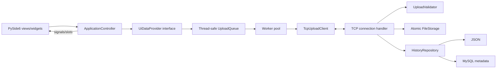

# Kiến trúc UDM_10

## Mục tiêu

UDM_10 là ứng dụng desktop client-server tải nhiều tệp. Kiến trúc ưu tiên cô
lập lỗi, không chặn GUI, stream file lớn và giữ domain/protocol độc lập khỏi Qt,
filesystem và MySQL.

## Ranh giới module

| Module | Trách nhiệm | Không chứa |
|---|---|---|
| `client/ui`, `client/widgets` | Bố cục, accessibility, state presentation | TCP, SQL, filesystem storage |
| `client/controllers` | Nối signal/slot và điều phối dialog | Business logic truyền file |
| `client/queue` | FIFO, giới hạn N, state transition thread-safe | QWidget |
| `client/transports` | TCP adapter và progress theo byte | UI trực tiếp |
| `domain` | Value object/trạng thái trung tâm | Qt/MySQL |
| `protocol` | Framing JSON length-prefix và message parsing | File storage |
| `server` | Connection, validation, reservation, stream/commit | GUI |
| `persistence` | Interface, JSON/MySQL repository | BLOB/file content |
| `config` | Cấu hình typed từ môi trường | Secret hard-code |

## Luồng upload

1. UI phát danh sách `Path`; provider đưa từng tệp vào FIFO `waiting`.
2. Queue claim tối đa N item và worker riêng chuyển sang `uploading`.
3. Client gửi `upload.start`; server validate metadata và giữ chỗ tên đích.
4. Khi `upload.ready`, client/server stream đúng số byte theo chunk.
5. Worker phát progress; Qt signal đưa snapshot bất biến về GUI thread.
6. Server commit atomic và trả kết quả riêng. Slot được giải phóng dù hoàn tất
   hay lỗi, rồi tệp FIFO tiếp theo bắt đầu.
7. Server ghi metadata/event vào backend history đã chọn.

## Cô lập và an toàn

- Mỗi worker có TCP connection riêng; lỗi mạng chỉ fail item liên quan.
- File `.part` cùng thư mục được commit atomic; payload thiếu bị dọn bỏ.
- Unicode NFC, basename-only, chống traversal/reserved Windows name.
- Reservation lock ngăn hai connection chiếm cùng tên.
- MySQL bật nhưng lỗi kết nối/schema: server dừng trước khi bind.
- Entry point chỉ bootstrap; không chứa business logic.

## Quyết định và giới hạn

- TCP là canonical; không có HTTP backend.
- JSON length-prefix cho control, raw binary cho payload.
- MySQL chỉ lưu metadata; filesystem lưu file vật lý.
- Không login, dark mode, auto-retry hay Pause/Resume.
- `MAX_FILE_SIZE_MB` và `ALLOWED_EXTENSIONS` vẫn cần xác nhận.
