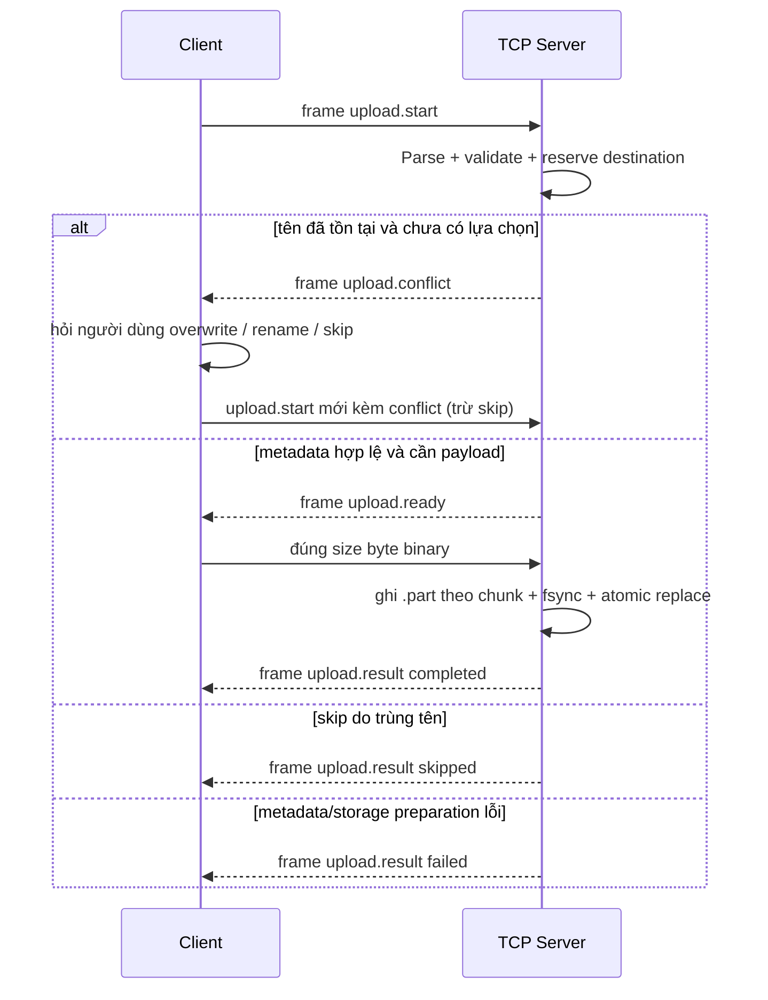

# UDM_10 TCP Upload Protocol

## 1. Phạm vi và phiên bản

Tài liệu này đặc tả transport canonical cho UDM_10. Giao thức dùng TCP thuần,
không có HTTP và không có Pause/Resume. Phiên bản hiện tại là `1` theo hợp đồng
message bên dưới; trường chưa biết phải được bên nhận bỏ qua để có thể mở rộng
tương thích.

Một TCP connection có thể xử lý nhiều file nối tiếp. Mỗi file luôn có
`request_id` và một `upload.result` riêng. Lỗi validation của một file không làm
đóng connection và không ngăn file kế tiếp, miễn framing của connection vẫn còn
hợp lệ.

## 2. Framing control message

Mọi control message được mã hóa theo cấu trúc:

```text
+--------------------------+-------------------------------+
| 4 byte unsigned integer  | JSON object UTF-8             |
| big-endian: độ dài JSON  | đúng số byte đã khai báo      |
+--------------------------+-------------------------------+
```

- Độ dài không bao gồm 4 byte header.
- JSON gốc bắt buộc là object và không được rỗng.
- Giới hạn mặc định: `TCP_CONTROL_MAX_BYTES=1048576`.
- File binary không được đặt trong JSON hoặc Base64. Payload file được truyền
  trực tiếp sau `upload.ready`.

## 3. Luồng upload một file



Client **phải chờ** `upload.ready` trước khi gửi payload. Nếu nhận
`upload.conflict` hoặc `upload.result` trực tiếp thì không được gửi payload của
request đó. Client không được tự chọn chính sách: `upload.conflict` phải đưa file
về trạng thái `waiting` và hiển thị lựa chọn cho người dùng.

Sau payload, client phải chờ `upload.result` trước khi gửi `upload.start` kế
tiếp. Payload chứa đúng `size` byte; byte thừa sẽ bị hiểu là đầu control frame
tiếp theo và làm hỏng connection.

## 4. Message

### 4.1. `health.check`

```json
{"type":"health.check"}
```

Response:

```json
{"type":"health.ok","service":"udm10-server","version":"0.1.0"}
```

### 4.2. `upload.start`

```json
{
  "type": "upload.start",
  "request_id": "5fdf6e2a",
  "filename": "Báo cáo tháng 08.pdf",
  "size": 1363149
}
```

| Field | Kiểu | Bắt buộc | Ý nghĩa |
|---|---|---:|---|
| `type` | string | Có | Luôn là `upload.start`. |
| `request_id` | string không rỗng | Có | ID do client tạo, duy nhất trong phạm vi tác vụ upload. |
| `batch_id` | string không rỗng | Không | ID chung cho các file được chọn trong cùng một lần; mặc định bằng `request_id` để tương thích. |
| `batch_total` | integer > 0 | Không | Tổng số file trong batch; mặc định `1`. |
| `filename` | string Unicode | Có | Chỉ là tên file, không phải đường dẫn. |
| `size` | integer >= 0 | Có | Số byte payload chính xác. File 0 byte được chấp nhận. |
| `conflict` | enum | Không | Chỉ gửi sau khi người dùng chọn `overwrite` hoặc `rename`. Không có mặc định ngầm. |

### 4.3. `upload.conflict`

```json
{
  "type": "upload.conflict",
  "request_id": "5fdf6e2a",
  "filename": "Báo cáo tháng 08.pdf"
}
```

Server trả message này trước `upload.ready` khi tên đã tồn tại hoặc đang được
giữ chỗ và request chưa có `conflict`. Client đóng transfer hiện tại, không gửi
payload, rồi hiển thị `DuplicateDialog`. Nếu chọn `overwrite` hoặc `rename`,
client tạo một transfer mới cùng upload item và gửi lựa chọn rõ ràng. Nếu chọn
`skip`, client chuyển item sang `skipped`, không mở binary transfer và chỉ gửi
control message `upload.skip` để lưu metadata bền vững.

### 4.4. `upload.ready`

```json
{"type":"upload.ready","request_id":"5fdf6e2a"}
```

Sau message này, client gửi đúng `size` byte binary. Server đọc và ghi theo
chunk `TCP_FILE_CHUNK_BYTES`, mặc định 65536 byte; không nạp toàn bộ file vào RAM.
Client tính phần trăm từ `bytes_sent / size` và tốc độ từ byte đã gửi cùng đồng
hồ đơn điệu của riêng worker đó; protocol không có progress tổng hoặc Resume.

### 4.5. `upload.result`

Thành công:

```json
{
  "type": "upload.result",
  "request_id": "5fdf6e2a",
  "status": "completed",
  "filename": "Báo cáo tháng 08.pdf",
  "bytes_received": 1363149
}
```

Tên trả về là tên thực tế trên server và có thể khác tên yêu cầu khi dùng
`rename`.

### 4.6. `history.list` và `history.result`

Client yêu cầu lịch sử bền vững bằng một connection riêng:

```json
{"type":"history.list"}
```

Server trả metadata dùng cho UI, không trả nội dung file:

```json
{
  "type": "history.result",
  "entries": [
    {
      "id": "5fdf6e2a",
      "name": "Báo cáo tháng 08_1.pdf",
      "completed_at": "2026-08-24T09:00:00+00:00",
      "size_bytes": 1363149,
      "result": "renamed"
    }
  ]
}
```

`result` là `success`, `renamed`, `failed` hoặc `skipped`. Nếu backend lịch sử
không đọc được, server trả `history.error`; client chuyển HistoryView sang error
state và cho phép thử lại. Việc tải diễn ra ngoài GUI thread.

### 4.7. `upload.skip`

```json
{
  "type": "upload.skip",
  "request_id": "5fdf6e2a",
  "batch_id": "batch-a12",
  "batch_total": 3,
  "filename": "Báo cáo tháng 08.pdf",
  "size": 1363149
}
```

Message này không có payload file. Server validate metadata, ghi trạng thái
`skipped` cùng event rồi trả `upload.result` với `bytes_received=0`.

Bỏ qua:

```json
{
  "type": "upload.result",
  "request_id": "5fdf6e2a",
  "status": "skipped",
  "filename": "Báo cáo tháng 08.pdf",
  "bytes_received": 0
}
```

Thất bại:

```json
{
  "type": "upload.result",
  "request_id": "5fdf6e2a",
  "status": "failed",
  "code": "incomplete_payload",
  "message": "Payload kết thúc trước dung lượng đã khai báo.",
  "bytes_received": 524288
}
```

`bytes_received` giúp client hiển thị lỗi/progress cuối cùng nhưng không tạo khả
năng Resume.

## 5. Chính sách trùng tên

- `overwrite`: ghi vào file tạm; chỉ thay file cũ bằng thao tác atomic sau khi
  nhận đủ payload. Upload lỗi không phá file cũ.
- `rename`: server giữ cả hai và chọn tên đầu tiên khả dụng theo mẫu
  `name_1.ext`, `name_2.ext`, ... Việc giữ chỗ được đồng bộ giữa các connection.
- `skip`: client không gửi payload hoặc `upload.start` lần hai; item chuyển thẳng
  sang `skipped`. Một control message `upload.skip` riêng ghi lịch sử mà không
  truyền nội dung file. Server vẫn hiểu `conflict=skip` để tương thích.

Server giữ reservation dưới lock trước khi trả `upload.ready`. Vì vậy hai
connection cùng tên không thể đồng thời chiếm cùng một đích. `rename` chọn tên
khả dụng trong cùng critical section; `overwrite` vào một đích đang upload nhận
`destination_busy` thay vì ghi đè cạnh tranh.

## 6. Validation và an toàn đường dẫn

Server không tin `filename` từ client:

- Chuẩn hóa Unicode NFC và bỏ khoảng trắng ngoài cùng.
- Chỉ chấp nhận basename; từ chối absolute path, `..`, `/`, `\\` và drive path.
- Từ chối control character, ký tự Windows bất hợp lệ `< > : " / \\ | ? *`,
  dấu chấm/khoảng trắng cuối tên và tên thiết bị như `CON`, `NUL`, `COM1`.
- Giới hạn mặc định 255 byte UTF-8 cho tên đã chuẩn hóa.
- Kiểm tra `MAX_FILE_SIZE_MB` và `ALLOWED_EXTENSIONS` khi được cấu hình.
- Resolve lại đích và xác nhận parent chính xác là thư mục upload tin cậy.

File được ghi vào `.part` ngẫu nhiên trong chính thư mục upload, `fsync`, rồi
commit atomic. Payload thiếu, timeout, disconnect hoặc lỗi ghi sẽ xóa file tạm
và reservation/placeholder.

## 7. Error codes

### Theo từng file (`upload.result`, `status=failed`)

| Code | Ý nghĩa | Connection có thể tiếp tục |
|---|---|---:|
| `invalid_metadata` | Thiếu/sai kiểu field hoặc conflict không hợp lệ. | Có, nếu client chưa gửi payload. |
| `invalid_filename` | Tên rỗng, path traversal, reserved hoặc ký tự nguy hiểm. | Có |
| `invalid_size` | Dung lượng âm hoặc sai quy tắc. | Có |
| `file_too_large` | Vượt `MAX_FILE_SIZE_MB`. | Có |
| `extension_not_allowed` | Không thuộc `ALLOWED_EXTENSIONS`. | Có |
| `incomplete_payload` | Peer đóng/ngắt trước khi đủ byte. | Thường không; server vẫn sống. |
| `transfer_timeout` | Không nhận thêm payload trong timeout. | Server trả lỗi rồi có thể tiếp tục nếu peer còn kết nối. |
| `storage_error` | Không thể chuẩn bị, ghi hoặc commit file. | Có nếu framing còn đồng bộ. |
| `destination_busy` | Một upload khác đang giữ đúng file đích. | Có |

### Theo connection (`error`)

| Code | Ý nghĩa | Hành vi server |
|---|---|---|
| `invalid_request` | Control frame/JSON không hợp lệ. | Gửi lỗi nếu có thể rồi đóng connection. |
| `connection_timeout` | Không có control frame mới trong timeout. | Gửi lỗi nếu có thể rồi đóng connection. |
| `unsupported_message` | `type` chưa hỗ trợ. | Trả lỗi; connection vẫn dùng được. |

## 8. Timeout và disconnect

`TCP_SOCKET_TIMEOUT_SECONDS` áp dụng cho cả control frame và từng lần chờ chunk
payload. Mặc định là 15 giây. Timeout không dừng server hoặc connection khác.

Nếu client disconnect giữa payload, upload đó nhận `incomplete_payload` khi còn
có thể trả response; file `.part` và reservation được xóa. Thread xử lý kết nối
kết thúc, còn listener và các upload khác tiếp tục hoạt động.

## 9. Cấu hình liên quan

```dotenv
TCP_BIND_HOST=127.0.0.1
TCP_HOST=127.0.0.1
TCP_PORT=9000
TCP_CONTROL_MAX_BYTES=1048576
TCP_SOCKET_TIMEOUT_SECONDS=15
TCP_FILE_CHUNK_BYTES=65536
UPLOAD_DIR=uploads
MAX_FILE_SIZE_MB=
ALLOWED_EXTENSIONS=
```

Giá trị trống của `MAX_FILE_SIZE_MB` và `ALLOWED_EXTENSIONS` nghĩa là chưa đặt
giới hạn tương ứng. `UPLOAD_DIR` tương đối luôn được resolve từ `D:\UDM`.

## 10. Verification

Hợp đồng framing, upload, duplicate, disconnect, timeout, history và payload
thiếu được kiểm tra tại `tests/unit/test_protocol_framing.py` và
`tests/integration/test_tcp_*.py`. Regression 2026-08-24: toàn bộ integration
suite đạt 25/25; TCP vẫn là transport canonical, không có HTTP fallback.
