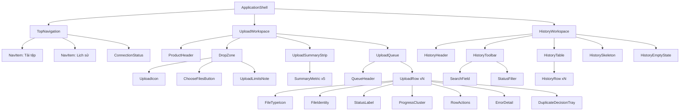

# UI Direction - UDM_10 Desktop

## 1. Trạng thái quyết định

- Impeccable mode: **Operate**.
- Surface: ứng dụng desktop PySide6 gồm `Tải tệp` và `Lịch sử`.
- Direction đề xuất: **Bàn chuyển tệp** (`Transfer Desk`).
- Trạng thái: **chờ xác nhận visual direction trước khi code UI hoàn chỉnh**.
- Đây là tài liệu shape/UX; không phải DESIGN.md và không thay thế review trên UI đã render.

## 2. Concept giao diện

### 2.1. Thesis

UDM_10 là một bàn làm việc vận hành liên tục: file đi vào tại một điểm tiếp nhận rõ ràng, xếp thành hàng, chuyển trạng thái ngay trên cùng một dòng và để lại bằng chứng trong lịch sử. Giao diện từ chối mô hình dashboard nhiều card và hình minh họa cloud-upload trang trí.

Tên direction “Bàn chuyển tệp” chỉ mô tả cấu trúc; giao diện không giả lập kho hàng, băng chuyền hay nhãn vận chuyển theo nghĩa đen.

### 2.2. First viewport

Ở 1366x768, người dùng nhìn thấy trong một màn hình:

1. Thanh điều hướng và trạng thái server.
2. Header ngắn với tên sản phẩm.
3. Drop zone lớn, có nút `Chọn tệp`.
4. Một dải thống kê không dùng card.
5. Header danh sách và tối thiểu 3-4 file đầu tiên.

Không có hero trang trí, biểu đồ hoặc panel giới thiệu chiếm chỗ của tác vụ.

### 2.3. Signature interaction

Drop zone là “điểm tiếp nhận”:

- Khi rỗng, cao khoảng 144-160px để dạy thao tác.
- Khi đã có file, thu gọn còn khoảng 96-112px nhưng vẫn luôn nhìn thấy.
- Khi drag-over, viền chuyển sang accent 2px, nền đổi sang `accent-subtle`, icon chuyển từ upload trung tính sang mũi tên hướng xuống; copy đổi thành `Thả tệp để thêm vào hàng đợi`.
- Chuyển động 160-200ms, chỉ truyền đạt thay đổi trạng thái; không có animation trang trí.

### 2.4. Topology

- Top navigation cố định trong cửa sổ, không dùng sidebar vì chỉ có hai destination.
- `Tải tệp` và `Lịch sử` là hai workspace ngang cấp.
- Upload workspace là một mặt phẳng liên tục: intake -> summary -> queue.
- Mỗi file là một row có separator; chỉ conflict/error mở rộng row thành decision/detail tray.
- Lịch sử dùng toolbar + table, không lặp lại card thống kê nếu không phục vụ quyết định.

## 3. Visual world

### 3.1. Vật liệu và hình học

- Canvas xám xanh rất nhạt; surface chính màu trắng.
- Đường phân cách 1px, không bọc từng phần tử bằng card.
- Bo góc nhỏ 6-8px cho control và vùng drop; row không bo riêng.
- Không gradient, glass, texture, custom scrollbar hoặc bóng đổ trang trí.
- Shadow chỉ dành cho overlay thật sự cần nổi khỏi mặt phẳng, ví dụ menu hoặc tooltip.

### 3.2. Typography

- Font hệ thống: `Segoe UI`, fallback `Noto Sans`, `Arial`, sans-serif.
- Một family duy nhất cho heading, control và dữ liệu.
- Tên file ưu tiên một dòng, ellipsis ở giữa hoặc cuối; full name trong tooltip và accessible name.
- Không dùng uppercase dài; chỉ dùng sentence case tiếng Việt.
- Số phần trăm và tốc độ dùng tabular numerals nếu font/platform hỗ trợ.

### 3.3. Iconography

- Line icon nhất quán, stroke khoảng 1.75-2px, kích thước 16/20/24px.
- Icon upload riêng ở header/drop zone; icon file theo nhóm định dạng, không cần icon cho mọi extension.
- Trạng thái luôn có bộ ba: icon + chữ + màu.
- Không dùng emoji làm icon sản phẩm.

## 4. Design tokens

### 4.1. Color

| Token | Giá trị | Dùng cho |
|---|---:|---|
| `canvas` | `#F5F7FA` | Nền cửa sổ |
| `surface` | `#FFFFFF` | Drop zone, queue, history |
| `surface-subtle` | `#EEF2F6` | Header row, hover trung tính |
| `text-primary` | `#17212B` | Heading, tên file, dữ liệu chính |
| `text-secondary` | `#52606D` | Mô tả, metadata |
| `text-disabled` | `#8994A1` | Disabled |
| `border` | `#D6DEE8` | Separator và control border |
| `border-strong` | `#A9B5C3` | Viền nhấn trung tính |
| `accent` | `#2457D6` | Primary action, active nav, uploading |
| `accent-hover` | `#1D47B2` | Hover primary action |
| `accent-subtle` | `#EAF0FF` | Drag-over, selected row |
| `focus` | `#0B63CE` | Focus ring 2px + offset 2px |
| `success` | `#18794E` | Icon/chữ Hoàn tất |
| `success-subtle` | `#E8F5EE` | Nền status detail thành công |
| `warning` | `#8A6100` | Cần xử lý/trùng tên |
| `warning-subtle` | `#FFF4CE` | Conflict tray |
| `error` | `#B42318` | Icon/chữ Lỗi |
| `error-subtle` | `#FEECEB` | Error detail |
| `offline` | `#475467` | Server offline |

Màu semantic không được dùng làm tín hiệu duy nhất. Text trên nền subtle vẫn dùng màu semantic đậm để giữ tương phản.

### 4.2. Typography scale

| Token | Size / line-height | Weight | Vai trò |
|---|---|---:|---|
| `display` | 28 / 36px | 650 | `Multiple Upload` |
| `title` | 20 / 28px | 600 | Tiêu đề workspace/section |
| `subtitle` | 16 / 24px | 600 | Tiêu đề decision tray |
| `body` | 14 / 20px | 400 | Nội dung mặc định |
| `body-strong` | 14 / 20px | 600 | Tên file, metric value |
| `small` | 13 / 18px | 400 | Metadata, trạng thái phụ |
| `caption` | 12 / 16px | 500 | Table header, helper text |

### 4.3. Spacing and size

- Base: 4px.
- Scale: `4, 8, 12, 16, 24, 32, 40, 48`.
- Top navigation: 56px.
- Control/click target: tối thiểu 40px; compact table action không nhỏ hơn 36px.
- Input/button height: 40px.
- Upload row: tối thiểu 64px; row có error/conflict được phép nở tự nhiên.
- Content margin: 24px ở 1366, 48px ở 1920; max content width khoảng 1440px và căn giữa.
- Radius: control `6px`, surface lớn `8px`, không dùng pill trừ status dot/compact connection indicator thật sự cần.

### 4.4. Border, elevation, motion

- Border mặc định: `1px solid border`.
- Drag-over/focus target: `2px` accent/focus, không làm layout nhảy.
- Overlay shadow duy nhất: `0 12px 32px rgba(23,33,43,0.16)`.
- Motion nhanh: 160ms; motion cấu trúc: 220ms.
- Easing: ease-out khi xuất hiện/mở rộng, ease-in khi thu gọn.
- Tôn trọng reduced motion; trạng thái vẫn rõ khi motion bị tắt.

## 5. Component tree

## 6. Component behavior

### TopNavigation

- Active destination có accent underline 2px và text đậm; không chỉ đổi màu.
- `ConnectionStatus` ở góc phải: icon link/check + `Đã kết nối`; icon broken-link + `Mất kết nối`.
- Khi offline, có thêm banner trong workspace; connection indicator không phải nơi duy nhất báo lỗi.

### DropZone

- Toàn vùng có thể click và focus bằng bàn phím; `Enter`/`Space` mở file picker.
- Nút `Chọn tệp` là primary action duy nhất trong empty state.
- Helper text hiển thị định dạng/dung lượng chỉ sau khi các giới hạn được xác nhận; không viết số giả.

### UploadSummaryStrip

- Năm metric nằm trên một hàng, chia bằng separator dọc.
- Giá trị lớn hơn nhãn; icon semantic nhỏ đi cùng Đang tải/Thành công/Lỗi.
- Không tạo năm card có border/shadow riêng.

### UploadRow

- Cột tên file linh hoạt; các cột status/progress/speed/action giữ độ rộng ổn định.
- Progress cluster chứa bar, phần trăm và tốc độ; screen reader nhận label đầy đủ.
- Action chỉ xuất hiện khi hợp lệ: `Xóa` cho Chờ/Lỗi/Hoàn tất, `Thử lại` cho Lỗi. Không thêm Pause/Resume.
- Error/conflict detail mở ngay dưới row liên quan để giữ ngữ cảnh.

### DuplicateDecisionTray

- Dùng inline expansion thay modal để người dùng vẫn thấy file và hàng đợi.
- Ba lựa chọn có radio/control rõ ràng, mô tả hậu quả ngắn và nút `Tiếp tục`.
- Không preselect lựa chọn nếu policy mặc định chưa được xác nhận.
- Có thể thêm `Áp dụng cho các tệp trùng còn lại` sau khi scope được xác nhận.

### HistoryTable

- Search ở trái, status filter ở phải hoặc cạnh search; toolbar không bọc card riêng.
- Table columns: `Tên tệp`, `Thời gian`, `Dung lượng`, `Kết quả`.
- Row hover nhẹ; row không mặc định click nếu chưa có hành động chi tiết được xác nhận.

## 7. Adaptation

### 1366x768

- Margin 24px; product header và drop zone nằm cùng một band hai cột.
- Queue hiển thị tối thiểu 3-4 row; phần danh sách cuộn độc lập nếu cần.
- Action dùng icon + accessible tooltip khi không đủ chiều rộng, nhưng action rủi ro vẫn cần label ở decision tray.

### 1920x1080

- Content max width khoảng 1440px, căn giữa; không kéo table tới toàn bộ 1920px.
- Header/drop zone có thêm khoảng thở; queue hiển thị nhiều row hơn, không phóng to typography.
- Các cột file và progress được nới; status/action không nở vô nghĩa.

### Cửa sổ hẹp hơn thiết kế mục tiêu

- Dưới khoảng 1120px, product header xếp trên drop zone.
- Tốc độ chuyển xuống dòng progress detail trước khi ẩn; không ẩn trạng thái hoặc phần trăm.
- History toolbar có thể wrap thành hai dòng.

## 8. Concept exploration record

Các thế giới được cân nhắc gồm preflight desk, parcel manifest, departure control, archive intake, print job ticket, mailroom ledger và transfer desk. Direction đề xuất dùng transfer desk vì giữ được tính phổ thông mà vẫn tạo cấu trúc vận hành rõ ràng.

Đối chiếu challenger của Impeccable:

- Split-flap concourse: **competitive** về khả năng quét trạng thái, nhưng fixed-cell typography và cascade motion làm tên file dài/action kém rõ.
- One-bit desktop: **declined** do tương phản nhị phân và pixel chrome đi ngược yêu cầu desktop hiện đại; direction giữ lại kỷ luật focus/pressed state phải không thể nhầm.
- Industrial starship terminal: **declined** vì chất sci-fi lấn át tác vụ; direction giữ lại kỷ luật mã lỗi ngắn, ổn định và có cấu trúc.
- Orienteering map: **declined** vì topology bản đồ không phù hợp file queue; direction giữ lại nguyên tắc tách rõ lớp dữ liệu nền và trạng thái đang hoạt động.
- Miura fold: **declined** vì interaction không quen thuộc; direction giữ lại nguyên tắc một thay đổi queue chỉ lan tới các item thật sự bị ảnh hưởng.
- Mesophotic dive: **declined** vì visual depth làm giảm scanability; direction giữ lại một trục tiến trình tuyệt đối, đọc được ở mọi row.

Phương án quen thuộc thay thế nếu direction này không được duyệt: **Preflight Desk**, rất rõ về validation và lỗi file nhưng có rủi ro tạo cảm giác công cụ kỹ thuật dành cho chuyên gia hơn người dùng phổ thông.

## 9. Cần xác nhận

1. Duyệt direction `Bàn chuyển tệp` hay chuyển sang `Preflight Desk` quen thuộc hơn.
2. Top navigation hai tab có được chốt thay cho sidebar không.
3. Có dùng icon upload chung tạm thời hay chờ logo/icon chính thức.
4. Hệ điều hành phát hành có chỉ là Windows không; nếu có, Segoe UI là ưu tiên số một.
5. Drop zone có được thu gọn khi queue có dữ liệu không.
6. Có cho phép thêm file khi server offline và tự chạy khi kết nối lại không.
7. Duplicate conflict xử lý từng file hay cho phép áp dụng một lựa chọn cho toàn bộ conflict còn lại.
8. `Bỏ qua` hiển thị/lưu lịch sử là `Hoàn tất`, `Lỗi` hay kết quả riêng `Đã bỏ qua`.
9. Có cho phép xóa item `Hoàn tất` khỏi danh sách hiện tại mà không xóa lịch sử không.
10. Chuẩn đơn vị: MB/MB/s hay MiB/MiB/s; định dạng thời gian và múi giờ lịch sử.
